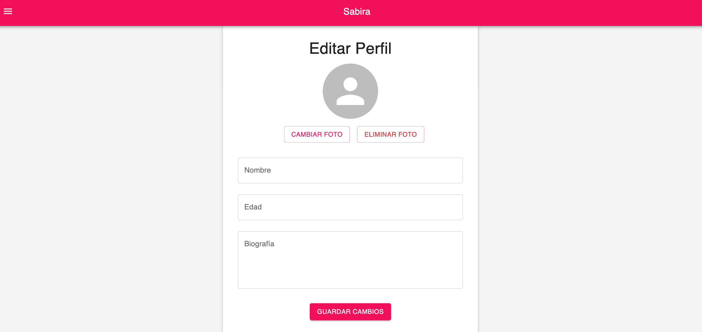
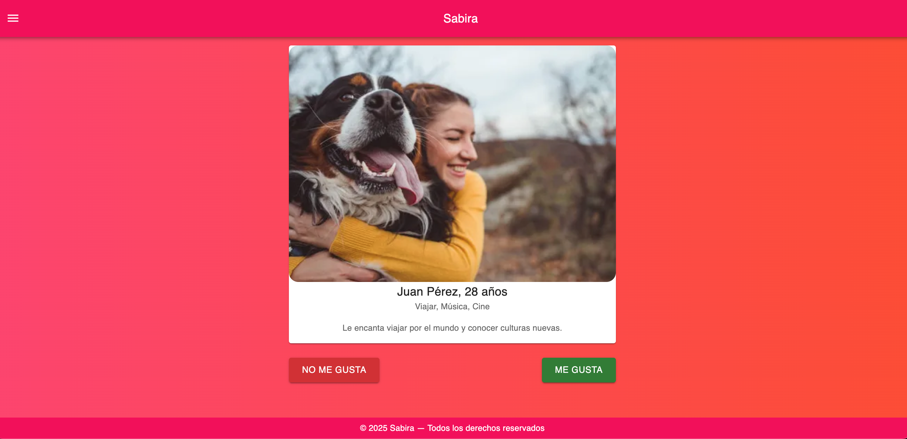
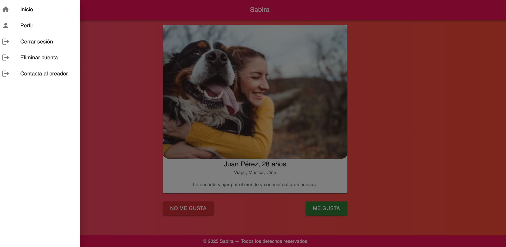
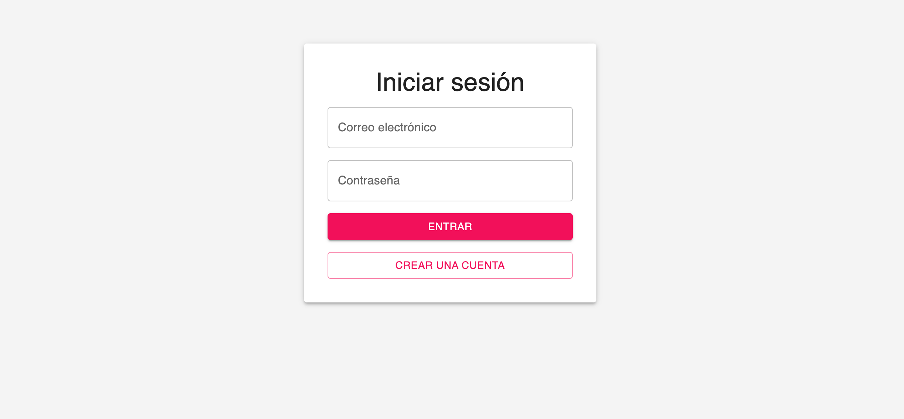
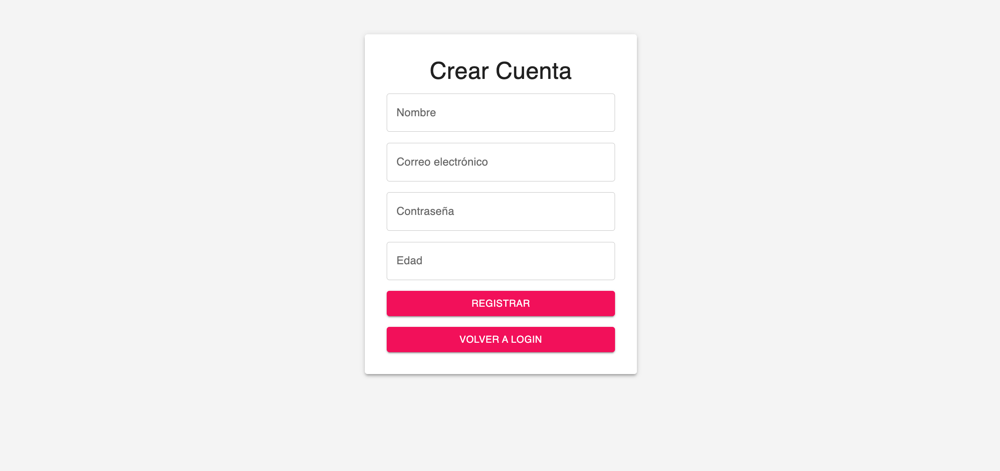

Nombre : app-web-citas

------------- NOTA IMPORTANTE :  Este proyecto esta siendo creado solo con Inteligencia Artificial (IA), esto para adaptarse/aprender el futuro del desarrollo y las nuevas herramientas que el avance de la tecnologia nos brinda. El desarrollo en parte con inteligencia artificial.

Plataformas: web

Backend: Node js Express con firestore firebase (Servicio de google Base de datos)

Framework: React 

Lenguaje de programación: Javascript

---------- ESTADO: En construcción

¿Qué hay en este repositorio?

Aquí encontraras el código fuente de la app web de citas

¿Qué es este proyecto?

Una aplicación web cuyo objetivo es crear un sitio para conocer personas

Imagenes estado actual

